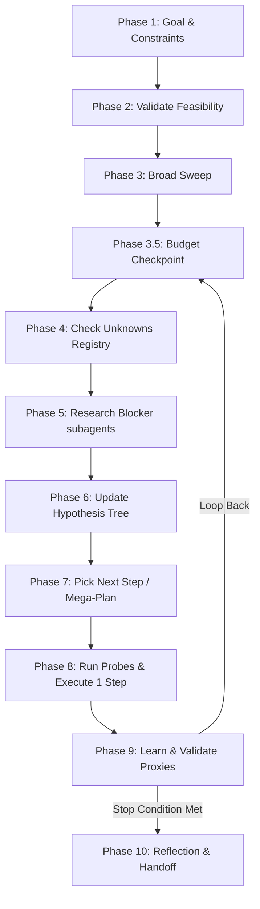

# deep-research-skills

[](LICENSE)
[](CONTRIBUTING.md)
[](skills/research-loop/docs/research-workflow.md)

An operationalized, time-aware **interleaved deep-research and execution workflow** for Devin and Antigravity agents. Designed specifically for time-constrained competitions, hackathons, and research-heavy tasks.

Unlike naive upfront-research loops, this repository implements a continuous **research → execute 1 step → learn → repeat** cycle driven by a persistent unknowns registry.

---

## 🚀 Workflow Architecture



---

## ✨ Key Features

- 🕒 **Time-Budget Pacing:** Continuously adjusts behavior (`explore` → `commit` → `sprint` → `last-stand` → `halt`) as the wall-clock time is consumed.
- 🎯 **Goodhart's Law Guardrails:** Prevents chasing fake proxies by validating process-reward metrics against real outcomes using Spearman rank correlation.
- 🛡️ **Read-Only Subagents:** Prevents write-conflict state drift by keeping research subagents read-only and returning structured summaries to the orchestrator.
- 🔎 **Independent Verification:** Integrates a skeptical verification subagent that confirms all extracted claims against primary sources to eliminate hallucinated details.
- 🚨 **Preventive & Reactive Escalation:** Outlines clear human-in-the-loop triggers (budget thresholds, plan divergence, flat progress) to ensure the human is notified before resource waste occurs.

---

## 📦 Project Structure

```
deep-research-skills/
├── README.md                      # Project documentation
└── skills/
    └── research-loop/
        ├── SKILL.md               # Main orchestrator skill
        ├── docs/
        │   ├── research-workflow.md  # Detailed loop execution workflow
        │   └── mega-plan-guide.md    # Planning reference guide
        └── templates/
            ├── unknowns-registry.md  # Living question queue template
            ├── landscape-table.md    # Solutions tracking table
            ├── hypothesis-tree.md    # MCTS-like confidence tree
            ├── decision-log.md       # Decision & branch pruning record
            ├── archive.md            # Pruned branch context archive
            ├── probe-registry.md     # Standalone validation tests registry
            ├── time-budget.md        # Session budget ledger
            ├── proxy-log.md          # Spearman validation log
            ├── human-escalation-policy.md # Escalate triggers checklist
            ├── session-state.json    # Machine-readable session state
            └── mega-plan.md          # Project implementation plan template
```

---

## 🛠️ Available Skills

### `/deep-research:research-loop` (Orchestrator)
The central loop coordinator. Manages time budgeting, updates persistent registries, delegates research, and implements the step-by-step execution path.

### `/deep-research:landscape-scan` (Subagent)
Performs scoped, bounded sweeps of rules, leaderboard results, public code, and write-ups/papers. Emits a verification-ready `claim_set`.

### `/deep-research:deep-dive` (Subagent)
Conducts a bounded depth-dive into a specific paper, codebase, or technique to extract concrete mathematical/architectural definitions.

### `/deep-research:verify` (Subagent)
A skeptical verifier that re-reads primary sources to confirm that claims are aligned, partially supported, or contradicted.

---

## 📝 License

This project is open-source and available under the MIT License.
